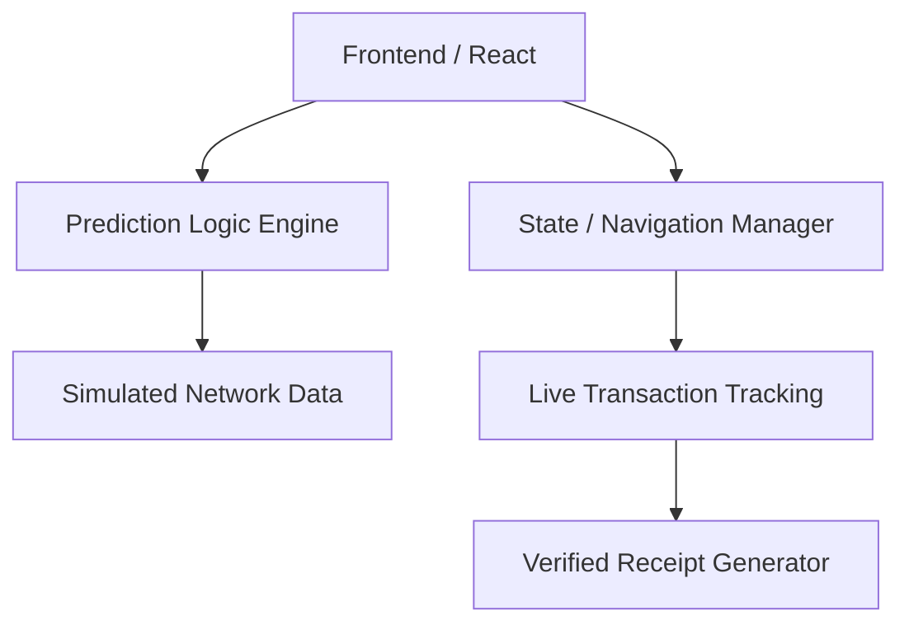

# SurePay - Ecobank Payment Reliability Intelligence Platform

SurePay is a payment reliability intelligence and recovery layer prototype designed for Ecobank. It aims to solve the uncertainty in interbank transfers by predicting payment success, tracking money in real-time, and securely verifying receipts.

## Problem Being Solved

Current banking transfers often leave users in the dark. If a transfer is delayed or fails, users do not know where their money is. Merchants rely on easily falsifiable SMS alerts or screenshots for payment confirmation. SurePay fixes this by providing intelligent predictions *before* sending, live tracking *during* sending, and a secure verification mechanism for merchants.

## Features

1. **Transfer Health:** Predicts the probability of a successful transfer before it is initiated.
2. **Money Tracker:** A live timeline showing exactly where the money is across the payment network.
3. **Verified Receipt:** A secure confirmation page for merchants to verify payment success.
4. **Scam Pause:** An intelligent risk intervention flow for potentially suspicious transfers.
5. **Reliability Center:** Analytics dashboard showing overall network health and bank-by-bank reliability.
6. **Operations Dashboard:** An internal view for bank operators to monitor incidents and reversal queues.

## AI/ML Approach

The AI prediction engine runs locally on simulated data. It considers variables such as destination bank, transaction amount, and beneficiary history to determine the success probability, risk level, and estimated processing time. 
For this prototype, a lightweight deterministic model is used, but a production version would use an ML algorithm like Random Forest or XGBoost on historical transaction data.

## Demo Mode / Data Simulation

This is a **prototype** using simulated data. Do not treat the data as actual Ecobank transaction data. 
To demo the various states, use the Transfer flow with different banks:
- **Access Bank:** High success rate, fast processing (Simulates Success)
- **UBA:** Moderate success rate, delayed processing (Simulates Delay)
- **Bank X:** Low success rate, high failure rate (Simulates Failure & Reversal)
- **Large Amount to New Beneficiary (e.g. ₦100,000+):** Triggers Scam Pause

## Tech Stack & Architecture

- **Frontend:** React + TypeScript, Vite
- **Styling:** Tailwind CSS
- **Charts:** Recharts
- **Icons:** Lucide React

## How to run locally

1. Navigate to the project directory: `cd surepay`
2. Install dependencies: `npm install`
3. Start the development server: `npm run dev`
4. Open the application in your browser at `http://localhost:5173`

## Future Production Architecture

In a production environment, SurePay would be integrated with Ecobank's core banking system, the NIBSS switch, and a centralized fraud/risk management API. The AI models would be hosted on scalable cloud infrastructure (e.g., AWS SageMaker or Azure ML) to process real-time transaction streams.

## Security Considerations

- **No real data:** This prototype uses synthetic data. No real Ecobank customer data or banking credentials are used or required.
- **Idempotency:** Real implementations must ensure idempotency for retry operations and reversals.
- **Privacy:** Verified receipts should minimize exposed PII.

## Limitations

- This is a UI and logic prototype; it does not process real money.
- USSD flows are simulated visually rather than functionally integrated with telecom providers.
- Real-time data is deterministic and mocked for presentation consistency.
